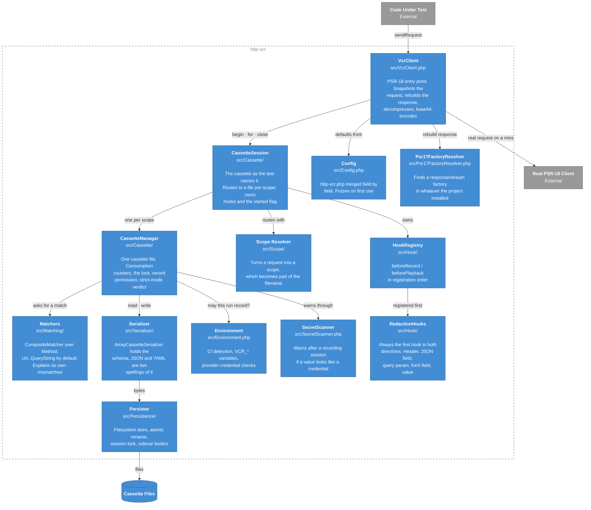
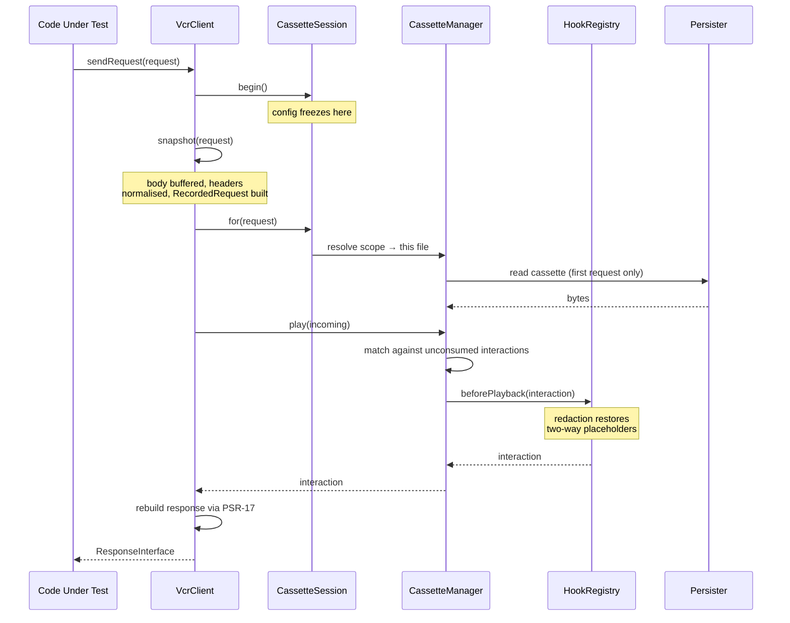

# Components

Level 3 opens up the library itself. Every box here is a class or a small cluster of them
in `src/`.

## Why the session and the manager are two classes

`CassetteSession` is *the name the test used*. `CassetteManager` is *one file*. Without
scoping those are the same thing and the session is a thin front. With
[a scope resolver](../advanced/scoping.md) one name spans a file per scope, and the two
responsibilities come apart: the hook pipeline and the redaction rules belong to the test,
while the lock, the consumption counters and the strict-mode verdict belong to each file
separately. Pooling the latter across scopes would hide which file a leftover interaction
was actually in — [ADR-0010](decisions/0010-scoping-splits-session-and-manager.md).

## A request, end to end

The dynamic view. This is one `sendRequest()` call, on a cassette that already has a
matching interaction:

On a **miss** the tail differs: `CassetteManager` reports whether recording is allowed, and
`VcrClient` either sends through the real client and appends the result — passing it through
`beforeRecord`, where redaction strips secrets before anything reaches the serializer — or
throws. Which exception depends on why:
`RecordingNotAllowedException` when the environment forbade it,
`CassetteNotFoundException` when there is no file, and
`NoMatchingInteractionException` when the file exists but nothing in it matched. The last
one carries the mismatch explanations the matchers produced, so the message says *which
field differed*, not just that nothing matched.

## Extension points

Four interfaces are meant to be implemented from outside:

| Interface | For |
|---|---|
| `Matching\RequestMatcherInterface` | Deciding whether a recorded request is *this* request. Add `ExplainsMismatch` to get your reason into the failure message |
| `Persistence\CassettePersisterInterface` | Storing cassettes somewhere other than the filesystem. Add `SupportsSessionLocking` if the store can hold an exclusive lock |
| `Serializer\CassetteSerializerInterface` | A different on-disk spelling of the same schema |
| `Scope\CassetteScopeResolverInterface` | Splitting one cassette name across several files |

The two "add this second interface" rows are deliberate. Both capabilities are things a
store or a matcher may genuinely be unable to provide, and requiring them on the main
interface would make perfectly good implementations impossible —
[ADR-0005](decisions/0005-session-lock-behind-an-optional-interface.md).
