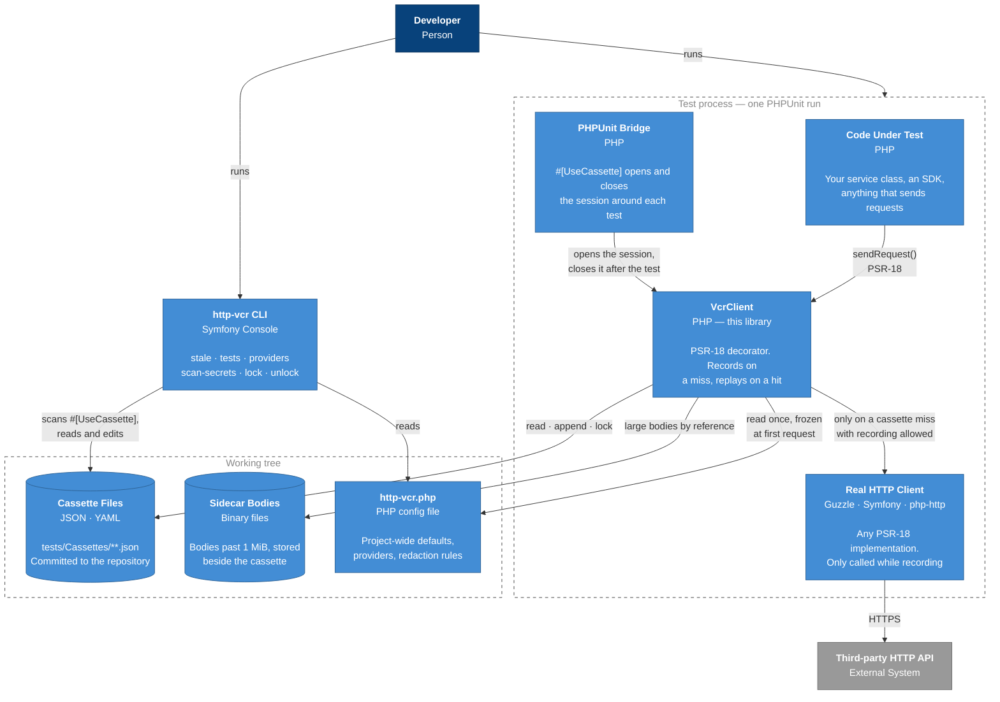

# Containers

Level 2 opens up the test process. "Container" in C4 normally means a deployable unit — a
service, a database, an app. For a library the useful reading is *a thing with its own
lifecycle*: the PHP process the tests run in, the files on disk that outlive it, and the
CLI you run separately.

## The one arrow that matters

`VcrClient → Real HTTP Client` is the only path to the network, and it is conditional. On a
cassette hit it is never taken; the response is rebuilt from the recorded snapshot through
a PSR-17 factory. That is what makes the suite deterministic — not a mock the test has to
set up, but a decorator that answers from a file.

Because the decorator sits *above* the real client, everything the client does — retries,
middleware, connection pooling — is on the far side of the recording. What lands in the
cassette is what the client returned, not what the wire carried.

## Lifecycles

The three boxes have genuinely different lifetimes, and most of the library's design
follows from that:

| Container | Lives for | Consequence |
|---|---|---|
| `VcrClient` | One instance, possibly many per test | Cheap to construct; holds no cross-test state |
| Cassette session | One test | Owns the lock, the consumption counters, the strict-mode verdict |
| Cassette file | The repository's lifetime | Must stay diffable and free of secrets |

The middle row is the subtle one. State that looks like it belongs on the client actually
belongs to the session, because the Guzzle bridge
[produces a fresh `VcrClient` per request](decisions/0011-guzzle-integrates-through-with-inner.md)
and hooks registered on one of them have to apply to all of them. See
[ADR-0006](decisions/0006-configuration-freezes-at-the-session.md) for why configuration
freezes at the session boundary rather than the object boundary.

## The CLI is a separate reader

`bin/http-vcr` runs outside the test process entirely. It never constructs a `VcrClient`;
it reads cassettes through the same serializer and finds `#[UseCassette]` declarations by
parsing test files with `nikic/php-parser` rather than by loading them. Static analysis
rather than reflection, so a test file that would fatal on load can still be inventoried.

See the [CLI Reference](../reference/cli.md) for the commands themselves.
