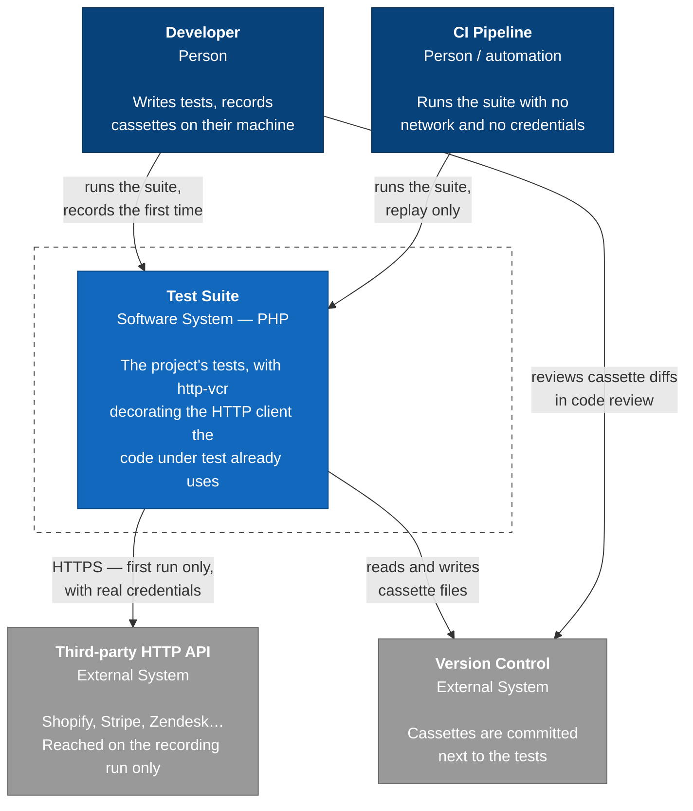

# System Context

The C4 model describes a system at four zoom levels. This page is level 1: what sits
around http-vcr and who talks to whom. [Containers](c4-containers.md) opens the test
process up, and [Components](c4-components.md) opens the library up.

One thing to keep in mind at every level: **http-vcr is a library, not a service.** Nothing
here is a running process you deploy. The boxes are the pieces of a test run, and the
"deployment" is `composer require --dev`.

## What the picture is claiming

**The API is reached exactly once per cassette.** The arrow from the suite to the
third-party API is dashed in spirit: it carries traffic on the run that records, and
nothing on every run after that. That is the whole point of the library, and it is also why
the arrow from CI to the API does not exist — [recording is refused on
CI](decisions/0003-recording-allowed-locally-refused-on-ci.md) so that a missing cassette
fails loudly instead of quietly spending real API quota from a build agent.

**Cassettes are source, not cache.** They are committed, reviewed, and diffed like any
other fixture. This is why the format is
[JSON by default](decisions/0002-json-cassettes-yaml-opt-in.md) and why
[secrets are redacted before the file is written](decisions/0007-redaction-normalizes-both-sides.md)
rather than after — a cassette that reached disk with a live token in it is already a
credential leak in the repository's history.

**There is no process-wide state.** http-vcr does not install a stream wrapper, patch
`curl`, or register anything global; it
[decorates one PSR-18 client instance](decisions/0001-decorate-a-psr-18-client.md). Two
`VcrClient` objects in one test run do not interfere, and code that was never handed a
decorated client keeps reaching the network exactly as before.

## Actors

| Actor | What they do | What they must have |
|---|---|---|
| Developer | Runs the suite locally, records the cassette the first time a test needs one, commits it | Real API credentials in the environment, network access |
| CI pipeline | Runs the same suite in replay | Neither. If a cassette is missing, the run fails rather than reaching out |

The split between those two rows is a rule the library enforces, not a convention it
suggests. See [Record Modes](../concepts/record-modes.md) for how the decision is made and
how to override it in either direction.
